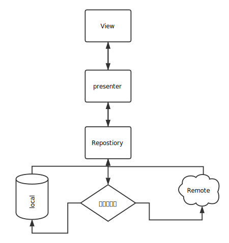
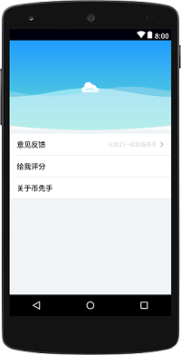

EYArchitecture
=====
MVP RXJava 基础架构
如今Android架构满天飞的年代，看多了就不知道怎么选择了。什么依赖注入、Mvvm、mvp等等各种辅助工具和框架思想，
当你真正拿到项目中去用的时候你会发现很多的不习惯，为什么要建立这么多的类和接口，怎么要这样调用。这就是学习成本
不管你愿不愿意这些成本都是每个程序员迈不过的一个砍，慢慢学习不断积累才是硬道理，如果感兴趣可以尝试看一看，取长补短
如果有什么让你深恶痛绝的还请海涵，提个Issue让我也有改进的空间
服务器端是之前我炒币的时候做的，不过国内被封后就没有续费了逻辑一切正常可供参考



项目结构图
-------
app结构图

支持库


自定义控件介绍
--------

1.弧形控件
--------
>ArcFrameLayout 类似优酷个人中心
设置圆弧方向和高度，纯色（渐变色，裁剪填充色）圆弧等
详细请参考 custom_attrs.xml

```xml
 <com.yb.ilibray.widgets.ArcFrameLayout
        android:id="@+id/headerArc"
        arcl:arc_suppert_background="false"
        arcl:arc_direction="Bottom"
        android:layout_width="match_parent"
        android:layout_height="wrap_content">
        <ImageView
            android:layout_width="match_parent"
            android:layout_height="200dp"
            android:scaleType="centerCrop"
            android:src="@drawable/bg_my"
            />
    </com.yb.ilibray.widgets.ArcFrameLayout>
```
2.波浪控件
--------
>1.设置振幅、高度、 颜色、距离
WaveView
```xml
        <com.yb.ilibray.widgets.WaveView
            android:id="@+id/waveView"
            android:layout_width="match_parent"
            android:layout_height="100dp"
            wave:wave_swing="30"
            android:layout_gravity="bottom"
            />
```
3.弧形控件和波浪控件组合使用
--------



```xml
 <com.yb.ilibray.widgets.ArcFrameLayout
        android:id="@+id/headerArc"
        wave:arc_suppert_background="false"
        wave:arc_direction="Bottom"
        android:layout_width="match_parent"
        android:layout_height="wrap_content">
        <ImageView
            android:layout_width="match_parent"
            android:layout_height="200dp"
            android:scaleType="centerCrop"
            android:src="@drawable/bg_my"
            />
        <ImageView
            android:id="@+id/cloud"
            android:layout_gravity="bottom|center_horizontal"
            android:layout_marginBottom="75dp"
            android:layout_width="40dp"
            android:layout_height="40dp"
            android:src="@drawable/error_view_cloud"/>
        <com.yb.ilibray.widgets.WaveView
            android:id="@+id/waveView"
            android:layout_width="match_parent"
            android:layout_height="100dp"
            wave:wave_swing="30"
            android:layout_gravity="bottom"
            />
    </com.yb.ilibray.widgets.ArcFrameLayout>
```
Author
------
Eric Yang - @ybADMIN on GitHub, yb498869020@hotmail.com on Email

License
-------
Copyright 2017 Eric Yang

Licensed under the Apache License, Version 2.0 (the "License");
you may not use this file except in compliance with the License.
You may obtain a copy of the License at

http://www.apache.org/licenses/LICENSE-2.0

Unless required by applicable law or agreed to in writing, software
distributed under the License is distributed on an "AS IS" BASIS,
WITHOUT WARRANTIES OR CONDITIONS OF ANY KIND, either express or implied.
See the License for the specific language governing permissions and
limitations under the License.